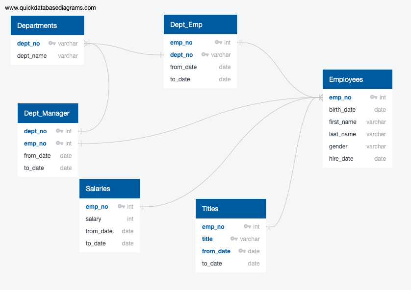

# Pewlett-Hackard-Analysis
### The Problem
Pewlett_Hackard (a fictional company)  is developing a longevity plan to ensure skills and experience within its workforce are maintained despite impending retirements. There are potentially thousands of employees eligible to retire. This leaves many positions vacant and a large training gap/ learning curve to overcome. PH wants to get a head start on preparing employees to fill future vacant positions.

### The Process

 To help PH accomplish their goals, it was necessary to create and organize data according to their needs. PH compiled and  provided all necessary employee data; however, further analysis and complex data combinations were required.

 - First an Entity Related Diagram was carefully created to establish data relationships and tables.
  

- Next, the employee data was imported to the mapped out and created tables.
  - For example: 
  
        CREATE TABLE employees (emp_no INT NOT NULL, birth_date VARCHAR NOT NULL, first_name VARCHAR NOT NULL, last_name VARCHAR NOT NULL, gender VARCHAR NOT NULL, hire_date DATE NOT NULL, PRIMARY KEY (emp_no) );

- It was determined that the number of retirement age employees should be filtered by:
  -  date of birth (1952-1955) and date hired (1985-1988). 
  -  These ranges determine both retirement age and retirement eligibility within PH company.
  
- These filters are the foundation for combing datasets to include information from different tables.

- Combined datasets include retirement eligible individuals with their: 
  - Employee numbers, 
  - first and last names, 
  - gender, salaries, 
  - job titles, 
  - and employment dates.

- Next, to establish which employees are eligible for a mentorship program another filter or condition was applied.
  - Employees born in 1965:

        Mentorship eligibility table--
        SELECT 	
            e.emp_no,
    	    e.first_name,
    	    e.last_name,
		    ts.title,
		    ts.from_date,
		    ts.to_date 
        INTO mentorship_eligibility  
            FROM employees as e 
        INNER JOIN titles as ts 
            ON e.emp_no = ts.emp_no 
        WHERE (e.birth_date BETWEEN        '1965-01-01' AND '1965-12-31');
- Finally, counts were compiled and employees were grouped by title. Duplicates were evaluated and removed.
  
### The Analysis
The total number of retirement eligible employees is: 41,380
-   Born from 1952 - 1955
-   Hired from 1985-1988

The total number of mentorship eligible employees is: 1,940 
-   Born in 1965

The largest number of retirement eligible employees are staffed as:

-   Senior Engineers (13,651)
-   Senior Staff (12,872)

For the future of Pewlett-Hackard's mentorship program, it is recommended that mentoring begin in these two staffing positions immediately. These positions are high-level requiring extensive training and experience.

-Senior Engineers and Senior Staff compose 80% of all potential employee retirement attrition.

Some limitations to this development and analysis are related to data availability. 

For example, it is recommended that additional information is collected regarding typical length of "learning curve" for specific positions to determine whether or not a one year mentorship program will suffice or if a longer or shorter program should be created.

